# arc-consumer设计文档

维护人：余琦

| 版本 | 修改内容 | 作者   | 创建时间   | 上一次review时间 |
| ---- | -------- | ------ | ---------- | ---------------- |
| 1    | 初始版本 | 余琦 | 2022-03-25 | 无               |


## 系统体系结构
| 项 | 标识符 | 功能 |
| ---- | -------- | ------ |
| 缓存 | cache | 数据缓存(弃用) |
| 数据转发 | proxy | 一三区数据传输 |
| 接口 | api | 对外接口 |


## cache 模块
### 需求梳理
> - 采集器发送过来数据，缓存到系统内存中，供给rawdb/websocket/restful。
> - 配置中设置 是否开启缓存、缓存时长、缓存过期清理。
> - 需要有开启关闭控制。
> - 以设备ID值存储，需携带时间戳，存储类型多样。


### cache设计概述
> - 缓存模块是对接收到的数据进行数据缓存（弃用）rawdb目前还是使用。
> - 将获取到的数据打上微秒级时间戳，设置时间对齐，与当前时间对比，超过设置的偏移时间则以当前时间为准。
> - 将获取到的数据在服务器中缓存10秒，3分钟后清理。
> - 在server.go中统一封装New/Start/Close/Stat，配置是否开启等。
> - audio/temperature/vibrate 使用common封装的cache包，调用Input/Search方法实现存储/获取。
> - 配置参数单独设计结构体，设置默认参数。


### cache模块结构描述
> - audio.go：音频缓存调用接口。
> - config.go：配置参数结构体以及设置默认参数及获取参数。
> - options.go：是一个将设置选项的函数。供New时调用。
> - server.go：New/Start/Close，供启动关闭调用。
> - temperature.go：音频缓存调用接口。
> - vibrate.go：音频缓存调用接口。


###环境变量配置参数
| 环境变量    | 类型 | 默认值 | 说明 |
| ------- | ------ | ---- | ---- |
| CACHE_ENABEL | bool | false | 缓存接口开关 |
| CACHE_TIMEOUT_MIN | int | 3 |  缓存清空超时时间(分钟) |
| CACHE_EXPIRE_MS | int | 10000 |  缓存数据时间(毫秒) |
| CACHE_SEARCH | bool | true | 只用查询才缓存开关 |


### 流程图
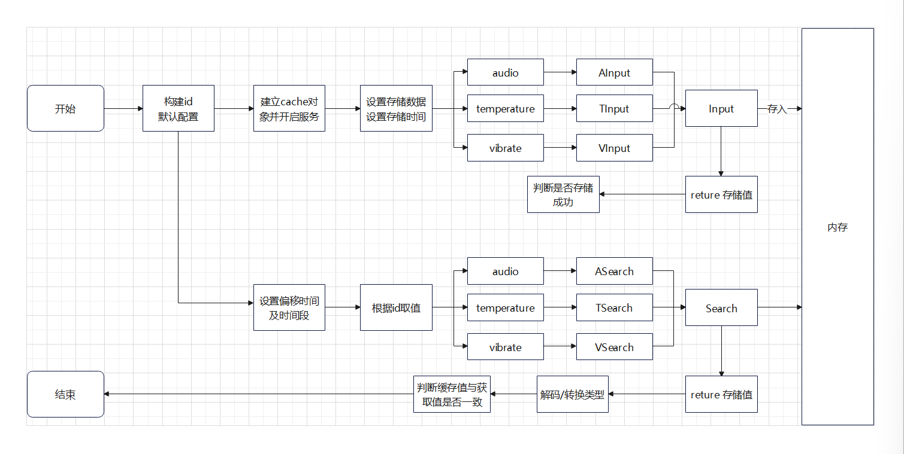


### cache模块详细设计
#### 处理缓存结构
```go
type DataCacheContainer struct {
caches        *sync.Map //使用sync.Map缓存数据
cleanTimer    *time.Ticker //缓存清空超时时间
idleTimeout   int //minute
running       *atomic.Bool
expire        int64 //到期时间
isPrintStat   bool //是否打印输出
isSearchCache bool //是否只用查询才缓存开关
logger        logging.ILogger //日志
}
```

#### 数据存储结构
```go
type DataPoint struct {
	ID   uint64	//id唯一标识号
	Time int64  //存储时间
	Data IData	//存储数据
}
```
#### 数据存储维护性结构
```go
type DataCache struct {
id         uint64   //id唯一标识号
lock       *sync.Mutex  //存储互斥锁
from       int64  //数据偏移时间
to         int64  //数据时间段
data       *linkedlist.List //数据
totalSize  uint64   //数据总大小
expire     int64    //到期时间戳
lastSearch int64
}
```


### 主要api
> - func New(opts ...Option) *Server
> - func (s *Server) Start(isDev bool)
> - func (s *Server) Close()
> - func (s *Server) Write(id uint64, frame *protocols.Frame) error
> - func (s *Server) ASearch(id uint64, from, to int64) (*cache.AudioData, error)
> - func (s *Server) AInput(id uint64, timestamp int64, data []byte) error


#### 1. New
- 函数作用：初始化cache缓存对象  
- 参数说明：  
  - 入参：opts ...Option  Option方法  
  - 返回值：*Server 缓存结构体对象   

-流程图：
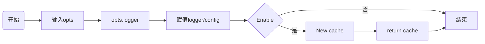

#### 2. Start
- 函数作用：开启cache缓存
- 参数说明：
    - 入参：isDev bool  是否开发模式启动
    - 返回值：无返回值

-流程图：
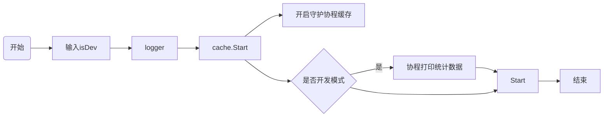

#### 3. Close
- 函数作用：关闭cache缓存
- 参数说明：
    - 入参：无参数
    - 返回值：无返回值

-流程图：
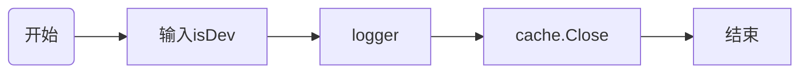

#### 4. Write
- 函数作用：缓存Frame包数据
- 参数说明：
    - 入参1：id uint64  设备id号
    - 入参1：Frame *protocols.Frame  Frame包对象
    - 返回值：err

-流程图：
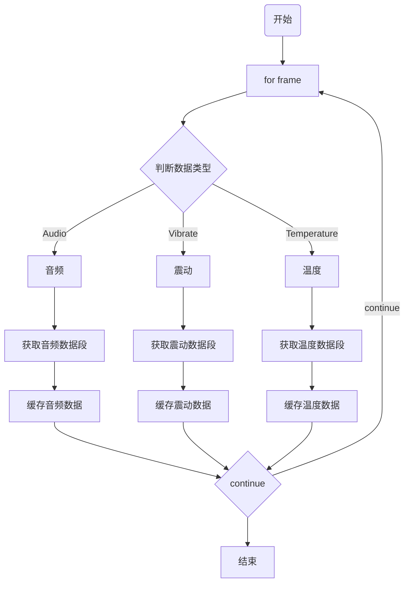

#### 3. AInput
- 函数作用：组装存储数据结构，ID、时间戳、数据。写入缓存数据 //TInput/VInput流程类似
- 参数说明：
  - 入参1：id uint64  设备id号
  - 入参2：timestamp int64  时间戳
  - 入参3：data []byte  缓存数据
  - 返回值：error

-流程图：
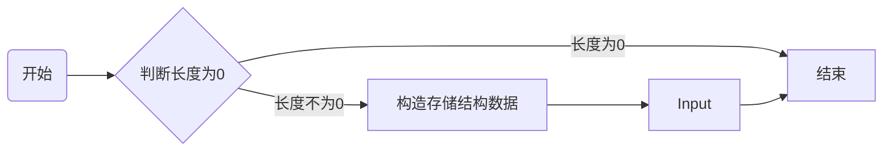

#### 3. ASearch
- 函数作用：组装查询数据结构，ID、偏移时间、时间段。查询缓存数据 //TInput/VInput流程类似
- 参数说明：
  - 入参1：id uint64  设备id号
  - 入参2：from int64  偏移时间
  - 入参3：to int64  数据时间段
  - 返回值1：*cache.AudioData 缓存数据
  - 返回值2：error

-流程图：
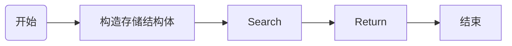


## proxy 模块
### 需求梳理
> - 一区向三区发送数据，把采集到的数据发送到三区。
> - 通过tcp/udp协议连发送数据。
> - 需要有开启关闭控制，解码配置。
> - 需要有连接池，断开重连机制。


### proxy设计概述
> - 该功能将将数据包通过TCP/UDP再次转发出去。目前用在涿州一区（生产区DCS间）开启TCP转发功能，将数据传到三区（办公区机房）。在三区存储文件以及入库等持久化数据。
> - 将获取到的数据解码打上微秒级时间戳，数据解码。
> - 通过tcp/udp协议向三区arc-consumer服务的gnet(8972端口)转发数据。
> - 在server.go中统一封装New/Start/Close/Write，配置等。


### proxy模块结构描述
> - config.go：配置参数结构体以及设置默认参数及获取参数。
> - options.go：是一个将设置选项的函数。供New时调用。
> - server.go：New/Start/Close/Write，供启动关闭调用。
> - services/args.go：tcp/udp参数结构体。
> - services/service.go：Service接口定义。
> - services/tcp.go：tcp接口实现。
> - services/udp.go：udp接口实现。
> - utils/functios.go：代理实现，供tcp/udp调用。
> - utils/io-limiter.go：代理读写，供tcp/udp调用。
> - utils/map.go
> - utils/pool.go：连接池，供tcp/udp调用。
> - utils/server-channel.go
> - utils/structs.go


### 环境变量配置参数
| 环境变量    | 类型 | 默认值 | 说明 |
| ------- | ------ | ---- | ---- |
| PROXY_ENABLE | bool | false | 代理转发开关 |
| PROXY_DECODE | bool | true |  解码开关(目前没有解码关闭配置需求) |
| PROXY_PARENT_TYPE | string | tcp |   转发上层协议类型  |
| PROXY_PARENT | bool | localhost:8972 | 上层地址  |
| PROXY_POOL_SIZE | int | 0 | 连接池大小, 解码开启不使用连接池  |
| PROXY_TIMEOUT | int | 2000 | 连接超时时间(秒)  |
| PROXY_CHECK_PARENT_INTERVAL | int | 3 | 定时连接检查间隔(秒), 发现连接断开，重新尝试连接  |


### 流程图
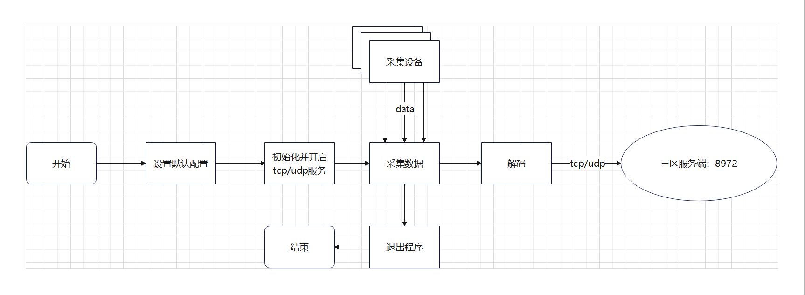


### proxy模块详细设计
#### 代理对象结构
```go
type Args struct {
	Parent              *string //目标服务地址端口
	ParentType          *string //传输类型
	Decode              *bool //是否编码
	Local               *string //本地地址端口
	Timeout             *int //超时时间
	PoolSize            *int //连接池总量
	CheckParentInterval *int //检查目标服务器间隙时间
}
type TCP struct {
    outPool  utils.OutPool 
    conn     net.Conn //连接对象
    status   bool //状态
    isClosed bool //是否结束
    cfg      TCPArgs //配置 
    logger   logging.ILogger //日志
}
```
#### 代理对象对象接口
```go
type Service interface {
	Start(args interface{}) (err error) //开启代理
	Write(data []byte) (n int, err error) //发送数据
	Clean() //关闭代理
}
```


### 主要api
> - func New(netType string, port int, opts ...Option) *Server
> - func (s *TCP) keepalive()
> - func (s *TCP) Start(args interface{}) error
> - func (s *TCP) callback(inConn net.Conn)
> - func ioCopy(dst io.Writer, src io.Reader, fn ...func(count int)) (written int64, err error)


#### 1. New
- 函数作用：初始化proxy缓存对象
- 参数说明：
  - 入参1：netType string  网络连接类型：tcp/udp
  - 入参2：port int  端口号
  - 入参3：opts ...Option  Option方法
  - 返回值：*Server 缓存结构体对象

-流程图：
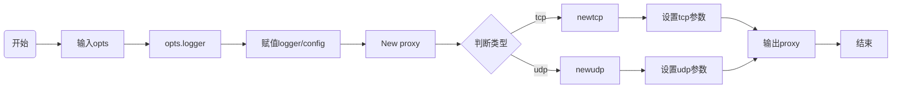

#### 2. keepalive
- 函数作用：协程开启解码操作
- 参数说明：
  - 入参：无
  - 返回值：无

-流程图：
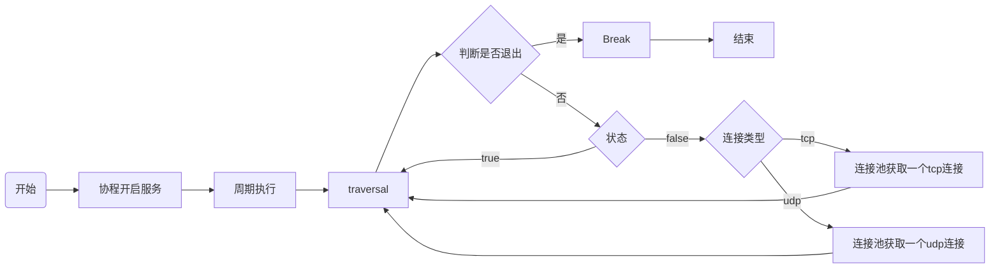

#### 3. Start
- 函数作用：开启代理服务，初始化连接，协程开启编码
- 参数说明：
  - 入参：args interface{} tcp/udp的参数
  - 返回值：error 错误信息

-流程图：
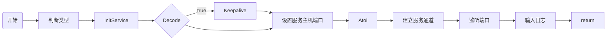

#### 4. callback
- 函数作用：连接回调函数
- 参数说明：
  - 入参：inConn 连接对象
  - 返回值：无

-流程图：
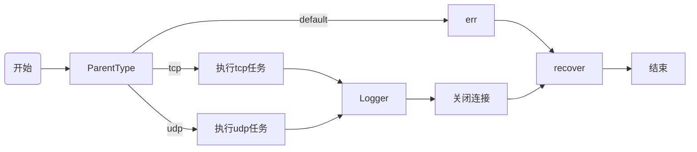

#### 5. ioCopy
- 函数作用：从源地址读数据，写入目的地址
- 参数说明：
  - 入参1：dst io.Writer 写入
  - 入参2：src io.Reader 读取
  - 入参3：fn ...func(count int)
  - 返回值1：written int64 读取到的数据
  - 返回值2：err error 错误信息

-流程图：
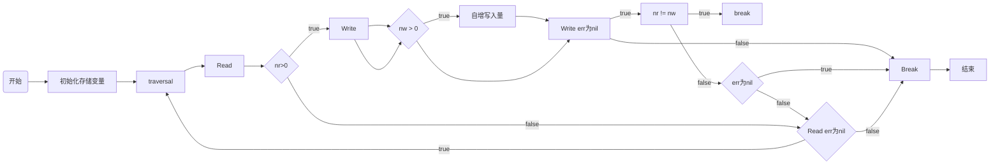


## api 模块
### 需求梳理
> - restful方式提供 获取服务健康/获取服务状态。
> - 提供缓存api路由 温度数据/原始音频数据/震动数据/音频数据标量数据/震动平均值。
> - 为上层应用提供数据，为Prometheus通过websocket方式提供数据。
> - 控制服务的开启状态，开启那些服务提供那些服务接口。


### api设计概述
> - 以采集设备ID标识每个设备，以","分隔，传入多个采集设备ID号查询。  
> - 提供gnet数据接收服务，采集设备tcp传输数据到gnet服务，缓存到内存中。  
> - 温度数据/原始音频数据/震动数据/音频数据标量数据/震动平均值从缓存值获取。  
> - restful方式去获取接口数据。  
> - 为Prometheus通过websocket方式提供数据。


### api模块结构描述
> - cache.go：从缓存中获取数据的接口，温度数据/原始音频数据/震动数据/音频数据标量数据/震动平均值。
> - options.go：配置参数结构体以及设置参数等。
> - router.go：路由。
> - server.go：服务结构体的定义及初始化。
> - status.go：设备状态服务接口。
> - websocket.go：websocket为上层应用提供数据。


###环境变量配置参数（基础配置）
| 环境变量    | 类型 | 默认值 | 说明 |
| ------- | ------ | ---- | ---- |
| BASIC_DEVMODE | bool | false | 是否配置开发模式 |
| BASIC_APIROOT | string | /api/needsetthis/v1 | api地址 |
| BASIC_APIPORT | int | 80 | 端口号 |
| BASIC_PROF | bool | false | 是否启动性能测试工具 |
| BASIC_DYNAMICCONFIG | bool | false | 是否启动动态配置 |
| BASIC_INSWARM | bool | true | 服务是否在docker swarm中 |


### 流程图
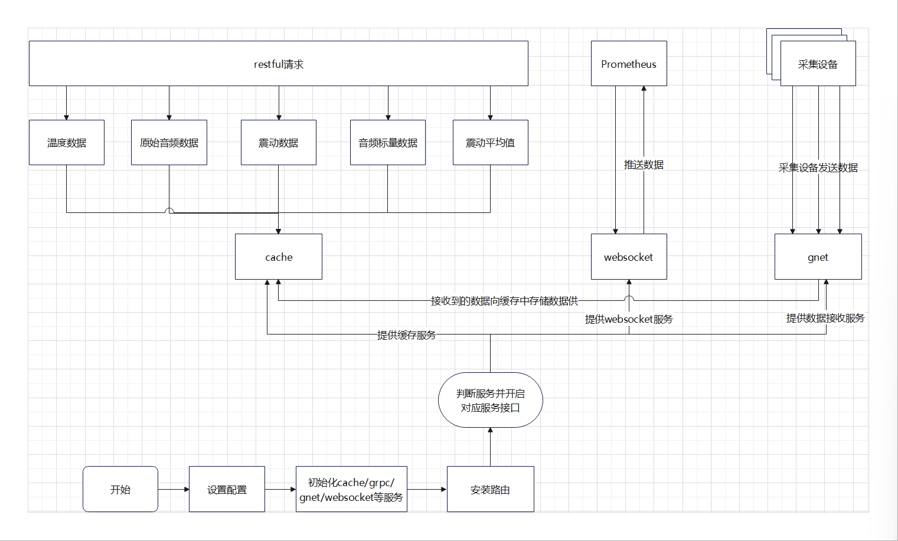


### api模块详细设计
#### api服务结构
```go
// Server api处理器
type Server struct {
logger          logging.ILogger //日志服务
ws              *ws.Server //websocket服务，向上层应用提供数据
gnet            *gnet.Server //gnet服务，负责接收采集器传输过来的数据
cache           *cache.Server //缓存服务
gossipKVCache   *microComponent.GossipKVCacheComponent //swarm服务数据同步缓存
vatd            *vatd.Server
selfServiceName string //服务名
}
```

#### 温度结构
```go
// TemperatureData contains tempratures of a collector
type TemperatureData struct {
CollectorID string      `json:"collectorid"` //设备ID
Count       int64       `json:"count"`  //数量
Data        interface{} `json:"data"` //数据
}
```

#### 响应结构(温度)
```go
// TemperatureDataResponse is the response for getting temprature
type TemperatureDataResponse struct {
Code int               `json:"code"` //状态码
Msg  string            `json:"msg"` //状态信息
Data []TemperatureData `json:"data"` //数据
}
```

#### 震动数据结构
```go
// Vibrate contains VibrateInfos of a collector
type Vibrate struct {
Time string `json:"time"` //时间
X    int16  `json:"x"` //X轴
Y    int16  `json:"y"` //Y轴
Z    int16  `json:"z"` //Z轴
}

// VibrateData contains VibrateInfos of a collector
type VibrateData struct {
CollectorID string    `json:"collectorid"` //设备ID
Count       int64     `json:"count"` //数量
Data        []Vibrate `json:"data"` //数据集
}
```


### 主要api
> - func (s *Server) CacheTemperatureData(c echo.Context) error
> - func (s *Server) CacheAudioData(c echo.Context) error
> - func (s *Server) CacheVibrateData(c echo.Context) error
> - func (s *Server) CacheEngineVATDData(c echo.Context) error
> - func (s *Server) CacheVibrateAvgData(c echo.Context) error
> - func (s *Server) getProfile(c echo.Context) error


#### 1. CacheTemperatureData
- 函数作用：restful请求温度数据，从缓存中获取数据
- 参数说明：
  - 入参：c echo.Context echo的上下文信息
  - 返回值：error 错误信息

-流程图：
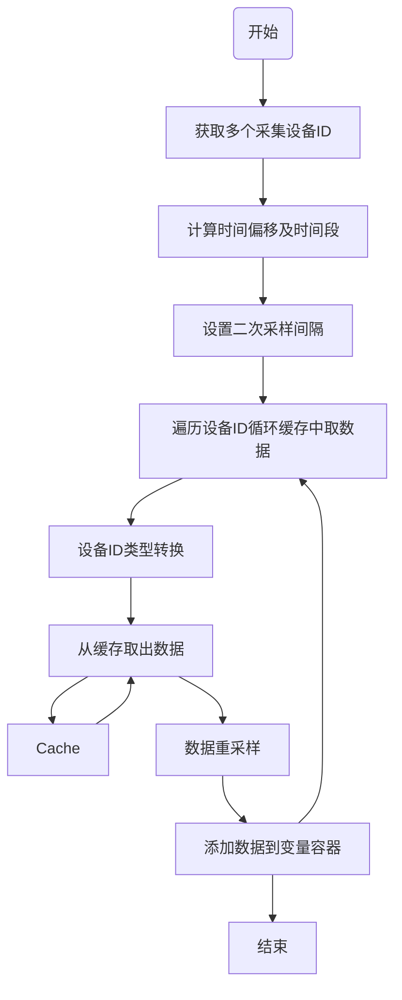

#### 2. CacheAudioData
- 函数作用：restful请求获取原始音频数据，从缓存中获取数据
- 参数说明：
  - 入参：c echo.Context echo的上下文信息
  - 返回值：error 错误信息

-流程图：
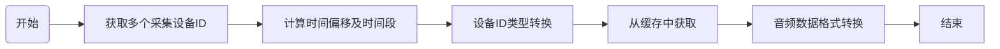

#### 3. CacheVibrateData
- 函数作用：restful请求获取震动数据，从缓存中获取数据
- 参数说明：
  - 入参：c echo.Context echo的上下文信息
  - 返回值：error 错误信息

-流程图：


#### 4. CacheEngineVATDData
- 函数作用：restful请求获取音频数据标量数据，从缓存中获取数据
- 参数说明：
  - 入参：c echo.Context echo的上下文信息
  - 返回值：error 错误信息

-流程图：
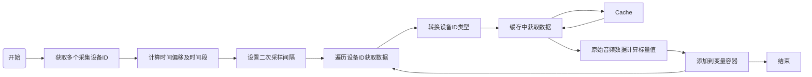

#### 5. CacheVibrateAvgData
- 函数作用：restful请求获取震动平均值获取，从缓存中获取数据，采集设备校验使用
- 参数说明：
  - 入参：c echo.Context echo的上下文信息
  - 返回值：error 错误信息

-流程图：
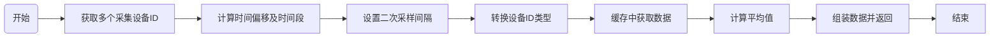

#### 6. getProfile
- 函数作用：restful请求获取设备状态信息
- 参数说明：
  - 入参：c echo.Context echo的上下文信息
  - 返回值：error 错误信息

-流程图：
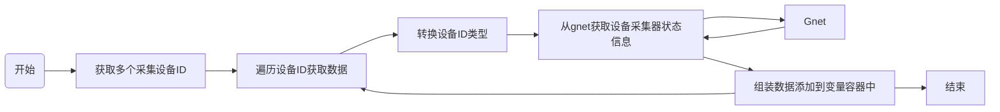


