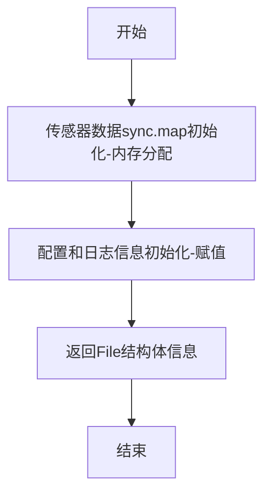
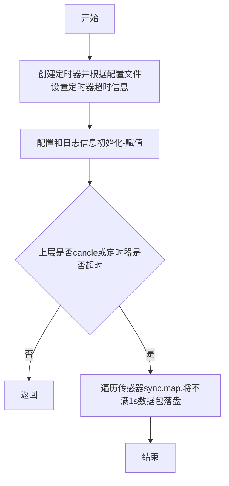
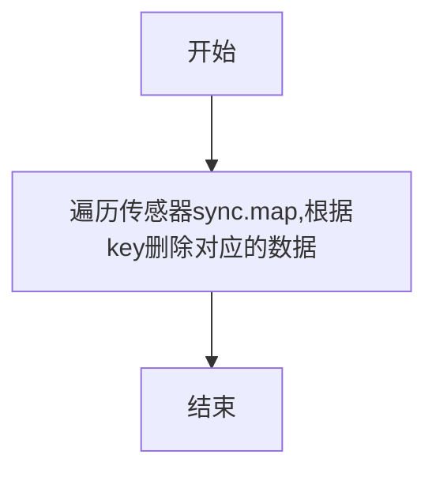
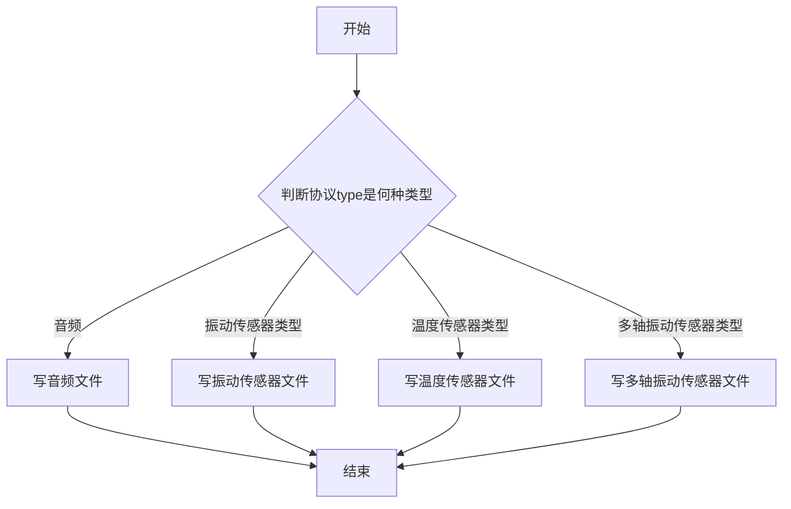
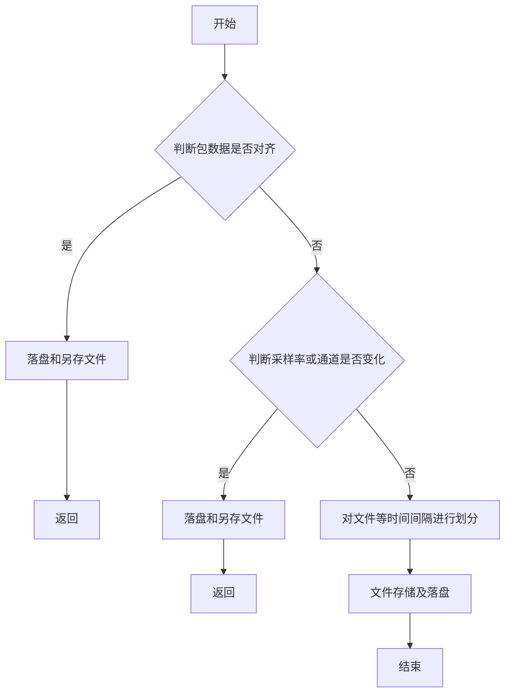
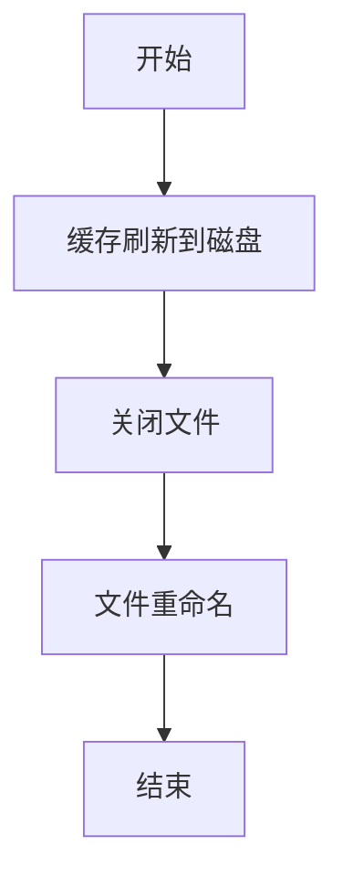
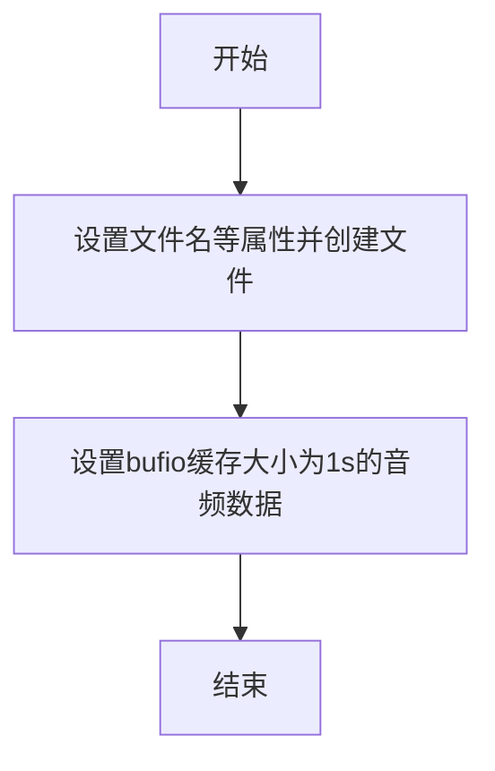
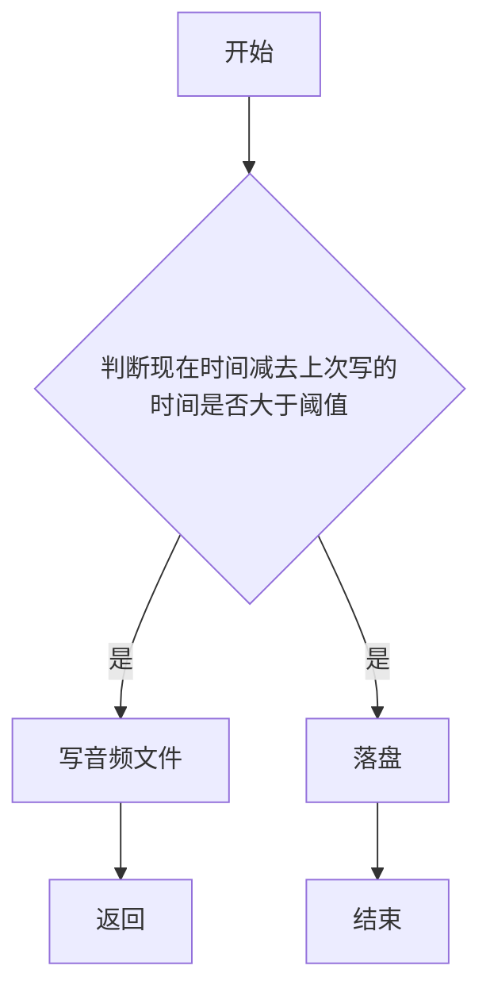
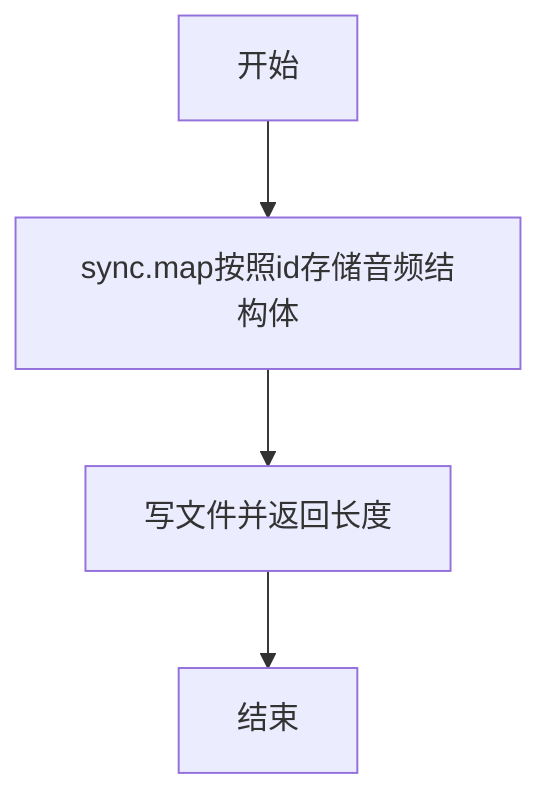

# receiver详细设计files模块

维护人：李欣

| 版本 | 修改内容                               | 作者 | 时间       |
| ---- | -------------------------------------- | ---- | ---------- |
| 1    | 初始版本， [receiver改进] 编写receiver服务files模块设计文档 | 李欣 | 2022-03-25 |

## files模块功能详细描述
- 将采集到的音频、多轴振动传感器、温度传感器、振动传感器（x,y,z三轴）数据保存至文件,该模块仅被reciever服务的子模块gnet所调用
## files模块结构描述
- file.go : 音频、多轴振动、温度、振动四类数据的对外接口，gnet模块gnet.go调用
- audio.go ：音频数据的处理文件，供file.go调用
- vibrate.go ：振动数据的处理文件，供file.go调用
- multiaxis_vibrate.go ：多轴振动数据的处理文件，供file.go调用
- temperature.go ：温度数据处理文件，供file.go调用
### file.go文件的详细设计
主要结构体描述

```
type File struct {
	aBuffer          *sync.Map //并发map保存音频数据
	vBuffer          *sync.Map //并发map保存振动传感器数据
	multiAxisVBuffer *sync.Map //并发map保存多轴传感器数据
	tBuffer          *sync.Map //并发map保存温度数据
	conf             *config.FileConfig  //配置文件
	logger           logging.ILogger  //日志文件
}
```

主要api
- func Create(c *config.FileConfig, logger logging.ILogger) *File
- func (s *File) Start(ctx context.Context, logger logging.ILogger)
- func (s *File) Write(logger logging.ILogger, id uint64, isSplit bool, frame *protocols.Frame) error
- func (s *File) Close(logger logging.ILogger)

1)  func Create(c *config.FileConfig, logger logging.ILogger) *File函数

函数作用：File结构体内参数的初始化，参数内存初始化和赋值操作

参数说明：

	 入参1-c *config.FileConfig  配置文件结构体
  
     入参2- logger logging.ILogger 日志信息

	 返回值：* File

函数流程图如下：


2)  func (s *File) Start(ctx context.Context, logger logging.ILogger)

函数作用：将不满1s的数据包落盘

参数说明：

	 入参1-c *config.FileConfig  配置文件结构体
  
     入参2- logger logging.ILogger 日志信息

	 返回值：无

函数流程图如下：	


3) func (s *File) Close(logger logging.ILogger)

函数作用： 释放资源，删除传感器缓存数据

参数说明：

        入参1- logger logging.ILogger 日志信息

函数流程图如下：



4) func (s *File) Write(logger logging.ILogger, id uint64, isSplit bool, frame *protocols.Frame) error

函数作用： 根据解协议的type，写相应的文件

参数说明：

        入参1- logger logging.ILogger 日志信息

        入参2- id uint64 

        入参3- isSplit bool 

        入参4- frame *protocols.Frame 解析协议的帧信息

函数流程图如下：



### audio.go文件的详细设计
主要结构体描述

```
// AudioFile -
type AudioFile struct {
	out  *bufio.Writer
	file *os.File
	path string // audio file path
}

// AudioWriter -
type AudioWriter struct {
	mutex      sync.Mutex
	file       []AudioFile
	id         uint64 // clientid -- subdir
	samplerate uint16 // current audio samplerate
	channel    int
	starttime  int64 // file data starttime
	lasttime   int64 // last write time ms
	timeoutMs  int64 // timeout writer new file
	threshold  int64 // file max duration
	logger     logging.ILogger
	dirent     string
}
```

主要api
- func (a *AudioWriter) write(startTime int64, isSplit bool, sa *protocols.SegmentAudio) (int, error)
- func (a *AudioWriter) flush() error
- func (a *AudioWriter) create(starttime int64, count int) error
- func (a *AudioWriter) Flush(tum int64) (bool, error)
- func (s *File) AWrite(logger logging.ILogger, id uint64, timestamp int64, isSplit bool, sa *protocols.SegmentAudio) (int, error)

1) func (a *AudioWriter) write(startTime int64, isSplit bool, sa *protocols.SegmentAudio) (int, error)

函数作用：音频文件的存储，每10分钟存储一次，若出现13-25分钟，需要进行分割存储

参数说明：

	 入参1-startTime int64 
  
     入参2- isSplit bool

     入参3- sa *protocols.SegmentAudio
	 返回值：int , error

函数流程图如下：

2) func (a *AudioWriter) flush() error

函数作用：将不满1s的数据包落盘

参数说明：

	 返回值：error

函数流程图如下：	


3) func (a *AudioWriter) create(starttime int64, count int) error

函数作用： 音频文件的创建

参数说明：

        入参1- starttime int64 文件的起始时间

        入参2- count int

函数流程图如下：



4) func (a *AudioWriter) Flush(tum int64) (bool, error)

函数作用： 

参数说明：

        入参1- tum int64

函数流程图如下：



5) func (s *File) AWrite(logger logging.ILogger, id uint64, timestamp int64, isSplit bool, sa *protocols.SegmentAudio) (int, error)

函数作用： 音频文件的写对外接口

参数说明：

        入参1- logger logging.ILogger 日志信息

        入参2- id uint64 

        入参3- isSplit bool 

        入参4- frame *protocols.Frame 解析协议的帧信息

函数流程图如下：



727 [文档化]文档更新-openssl update

729 [文档化]文档更新-UnixLinux基础讲义

730 [文档化]文档更新-vsftp部署

