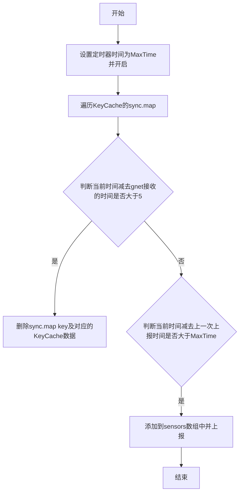
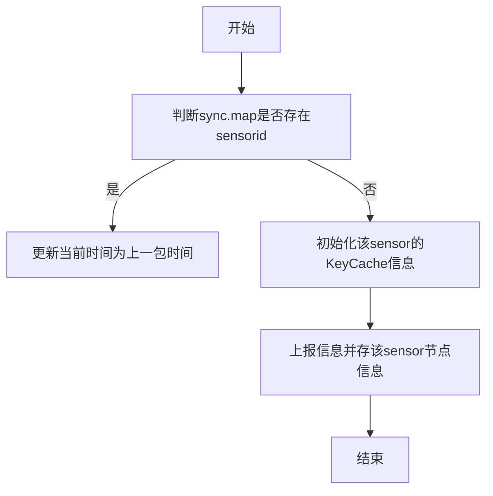

# receiver详细设计goss模块

维护人：李欣

| 版本 | 修改内容                               | 作者 | 时间       |
| ---- | -------------------------------------- | ---- | ---------- |
| 1    | 初始版本， [receiver改进] 编写receiver服务goss模块设计文档 | 李欣 | 2022-03-28 |

## goss模块功能详细描述
- 保存gnet收包sensor节点信息并上报
## goss模块结构描述
- goss.go : 保存gnet收包sensor节点信息并上报
### goss.go文件的详细设计
主要结构体描述

```
type KeyCache struct {
	SensorID string    //sensor id
	Last     int64     //上一次上报的时间
	LastPkg  int64     //gnet接收到最后一包数据的时间
}

type Server struct {
	Cache         *sync.Map
	MaxTime       int64
	gossipKVCache *microComponent.GossipKVCacheComponent
}
```

主要api
- func Create(kvc *microComponent.GossipKVCacheComponent, second int64) *Server
- func (s *Server) Start(ctx context.Context, logger logging.ILogger)
- func (s *Server) Sync(logger logging.ILogger, sensorid uint64) error

1)  func Create(kvc *microComponent.GossipKVCacheComponent, second int64) *Server

函数作用：创建goss服务对象
参数说明：
  
     入参1- kvc *microComponent.GossipKVCacheComponent 

     入参2- second int64   设置MaxTime

	 返回值：* Server

函数流程图如下：
略

2)  func (s *Server) Start(ctx context.Context, logger logging.ILogger)

函数作用：recieve服务开启

参数说明：

     入参1- ctx context.Context 

     入参2- logger logging.ILogger 日志信息

	 返回值：* Server

函数流程图如下：	


3) func (s *Server) Sync(logger logging.ILogger, sensorid uint64) error

函数作用： Taos结构体初始化

参数说明：

        入参1- logger logging.ILogger 日志信息

        入参2- sensorid uint64

        返回值：s *Server

函数流程图如下：
