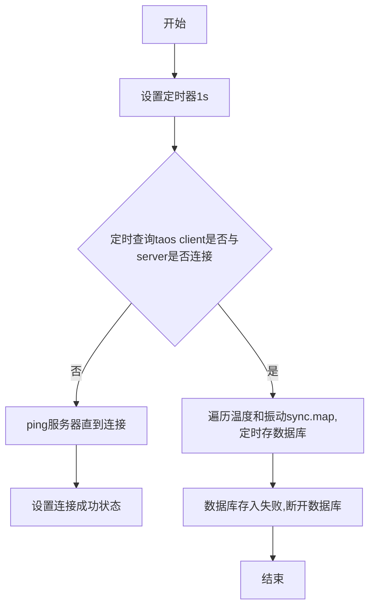
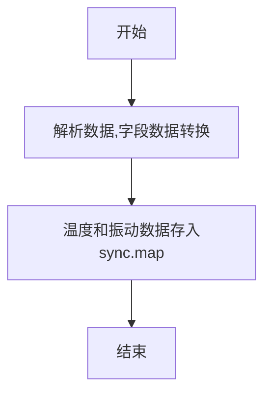

# receiver详细设计taos模块

维护人：李欣

| 版本 | 修改内容                               | 作者 | 时间       |
| ---- | -------------------------------------- | ---- | ---------- |
| 1    | 初始版本， [receiver改进] 编写receiver服务taos模块设计文档 | 李欣 | 2022-03-28 |

## taos模块功能详细描述
- 将采集到的温度传感器、振动传感器（x,y,z三轴）数据保存至数据库
## taos模块结构描述
- tao.go : 温度、振动传感器数据的对外接口
- crud.go ：taos数据库表的建立及crub操作（create、remove、uodate、delete）
- vibrate.go ：振动数据的处理文件
- temperature.go ：温度传感器数据处理文件
### taos.go文件的详细设计
主要结构体描述

```
type Taos struct {
	srv           *TaoClient
	tBuffer       *sync.Map
	vBuffer       *sync.Map
	cBuffer       *sync.Map
	status        bool
	vsamplerateMs int
	mutex         sync.Mutex
}
```

主要api
- func (s *Taos) disconnect(logger logging.ILogger) 
- func (s *Taos) connect(logger logging.ILogger)
- func Create(logger logging.ILogger, c interface{}) (*Taos, error)
- func (s *Taos) Close(logger logging.ILogger)
- func (s *Taos) Start(ctx context.Context, logger logging.ILogger)
- func (s *Taos) Write(id uint64, frame *protocols.Frame) error

1)  func (s *Taos) disconnect(logger logging.ILogger) 

函数作用：设置taos客户端与服务器连接状态，status为false（断开）
参数说明：
  
     入参1- logger logging.ILogger 日志信息

	 返回值：* Taos

函数流程图如下：
略

2)  func (s *Taos) connect(logger logging.ILogger)

函数作用：设置taos客户端与服务器连接状态，status为true（连接）

参数说明：

     入参1- logger logging.ILogger 日志信息

	 返回值：* Taos

函数流程图如下：	
略

3) func Create(logger logging.ILogger, c interface{}) (*Taos, error)

函数作用： Taos结构体初始化

参数说明：

        入参1- logger logging.ILogger 日志信息

        入参2- c interface{} 接口

函数流程图如下：
略

4) func (s *Taos) Close(logger logging.ILogger)

函数作用： 通过温度和振动传感器sync.map进行遍历，并删除对应的key，关闭数据库

参数说明：

        入参1- logger logging.ILogger 日志信息

函数流程图如下：
略

5) func (s *Taos) Start(ctx context.Context, logger logging.ILogger)

函数作用： 开启taos服务

参数说明：

        入参1- ctx context.Context context上下文

        入参2- logger logging.ILogger 日志信息

函数流程图如下：



6) func (s *Taos) Write(id uint64, frame *protocols.Frame) error

函数作用： 根据协议类型存入sync.map，等待入库

参数说明：

        入参1- id uint64

        入参2- frame *protocols.Frame

函数流程图如下：

