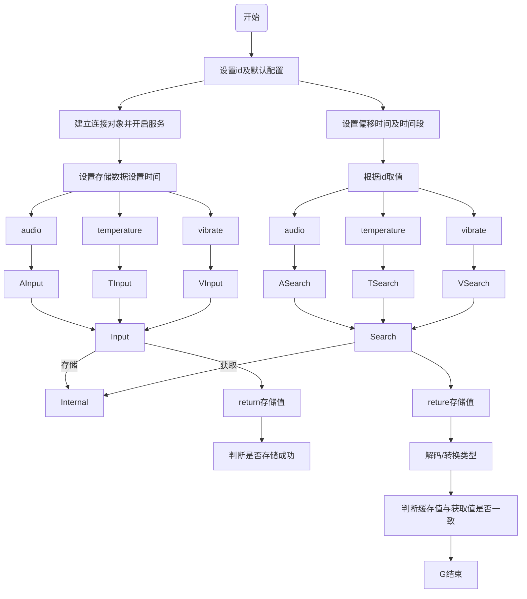
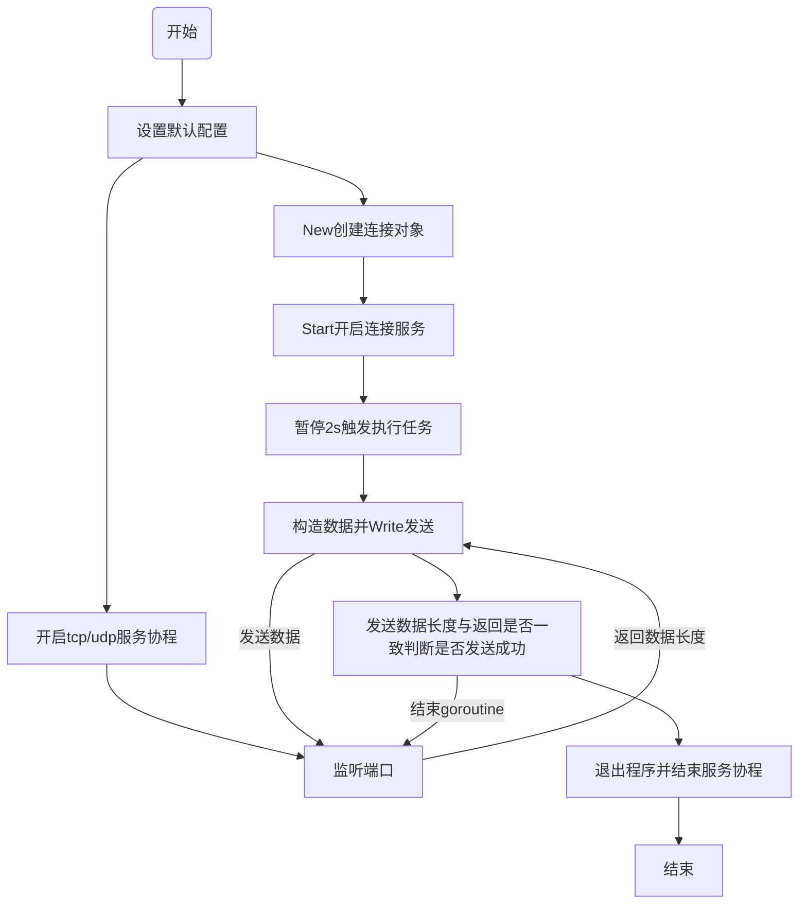

# 单元测试 

# 版本信息记录

| 日期     | 版本 | 说明 | 作者 |
| -------- | ---- | ---- | ---- |
| 20220322 | 1    |      | 余琦     |

## 目的

> 测试各个模块的功能是否符合需求

## 术语和定义

## 测试整体设计

> 采用Go Convey + Go Monkey 的单元测试工具

## 测试方法

> 命令行执行：go test -v 或 go test -cover -v [指定测试文件]

#测试模块

## 1. pkg/cache

### 1.1 测试功能
> cache：audio/temperature/vibrate 根据id存储数据，获取数据

### 1.2 流程图

### 1.3 测试需求及结果
| 序号 | 需求 | 输入 | 输出 | 是否满足需求 | 覆盖率 | 说明 |
| --- | ----- | ---- | ---- | ---- | ---- | ---- |
| 1 | 执行audio | []byte{1, 2, 3} | []byte{1, 2, 3} | true | 51.8% | 存储byte类型取出还是byte类型 |
| 2 | 执行temperature | 25 | 25 | true | 51.8% | 存储int16类型，返回float32类型，需要转换类型 |
| 2 | 执行vibrate | {0 0 0} | {0 0 0} | true | 51.8% | 存储结构体类型，获取了处理后进行比较 |

## 2. pkg/proxy

### 2.1 测试功能
> proxy：tcp/udp发送数据是否成功

### 2.2 流程图

### 2.3 测试需求及结果
| 序号 | 需求 | 输入 | 输出 | 是否满足需求 | 覆盖率 | 说明 |
| --- | ----- | ---- | ---- | ---- | ---- | ---- |
| 1 | 执行tcp New Start Write无错误 write成功返回输入参数长度 | 123456 | 6 | true | 90.0% |  |
| 2 | 执行udp New Start Write无错误 write成功返回输入参数长度 | 654321 | 6 | true | 90.0% |  |

